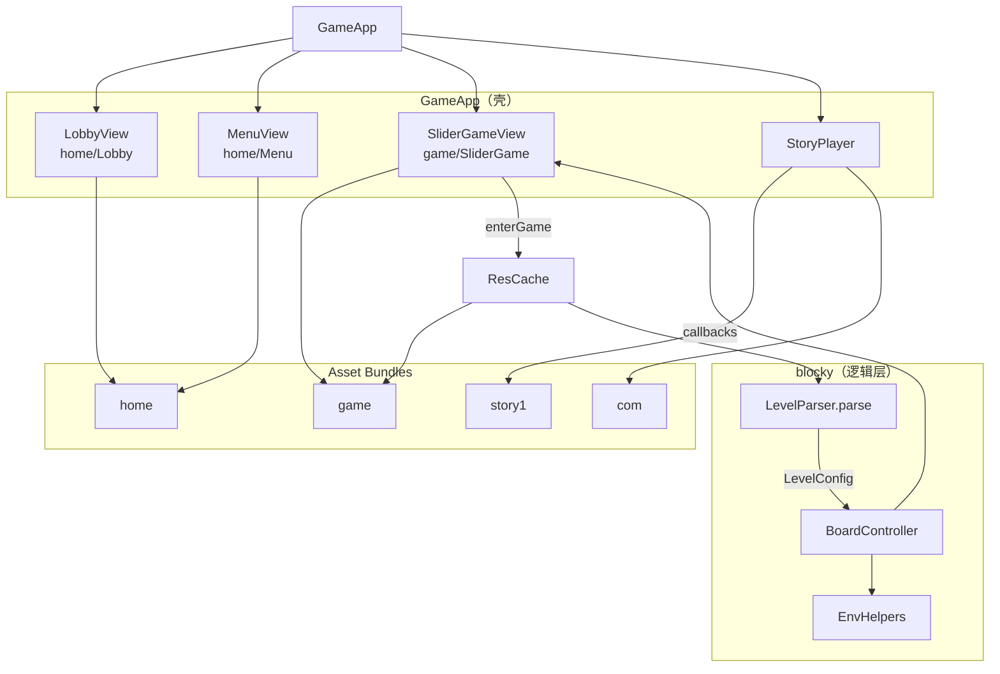

# Block Reveal — 工程架构文档

> 供新对话智能体 / 开发者快速熟悉项目。  
> 项目：Unity 原版 **Block Reveal: Slide & Match**（`com.halagames.blockreveal`）的 Cocos Creator 3.8.8 复刻。

---

## 1. 项目概述

| 项 | 说明 |
|----|------|
| 引擎 | Cocos Creator **3.8.8** |
| 语言 | TypeScript |
| 入口场景 | `assets/scenes/Main.scene` |
| 入口组件 | `GameApp`（挂于 Canvas） |
| 关卡规模 | **650 关**（`Lv_0001.txt` … `Lv_0650.txt`） |
| 核心玩法 | 滑动 Polyomino 方块，按 `listIndexPicture` 拼合完整图片即揭示过关 |
| Unity 参考工程 | `d:\unityObj\blockNew`（IL2CPP，脚本体为空，仅作资源/格式参考） |

**设计分辨率：** 1080 × 1920（`SHOW_ALL`）

---

## 2. 目录结构

```
slider_cocos/
├── assets/
│   ├── scenes/
│   │   └── Main.scene              # 唯一主场景，Canvas → GameApp
│   ├── bundle/
│   │   ├── game/                   # Asset Bundle「game」：关卡 / 揭图 / 局内 UI / 音效
│   │   │   ├── levels_br/Lv_XXXX.txt
│   │   │   ├── pictures/**
│   │   │   ├── sprite/ui_br/**
│   │   │   ├── prefab/SliderGame.prefab
│   │   │   └── audio/**
│   │   ├── home/                   # Asset Bundle「home」：大厅 / 选关
│   │   │   ├── sprite/**           # zy_bj, logo, an_lv, an_lan, gk_bj
│   │   │   └── prefab/Lobby.prefab, Menu.prefab
│   │   ├── com/                    # Asset Bundle「com」：公共弹窗
│   │   │   └── prefab/Dialogue, Tip, PopupTemplate
│   │   └── story1/                 # 剧情 bundle（story.json + step 图）
│   ├── resources/                  # 默认 resources bundle（兼容保留）
│   │   ├── img/**
│   │   └── levels/all.json         # 旧版关卡（ResCache 兼容保留）
│   └── scripts/
│       ├── game/
│       │   ├── GameApp.ts          # ★ 应用入口：实例化 Lobby/Menu/Game 预制体
│       │   ├── SliderGameView.ts   # game 预制体视图
│       │   ├── LevelEditor.ts      # 关卡编辑器
│       │   └── BoardController.ts  # ⚠ 旧版「超级滑块」，已废弃
│       ├── home/
│       │   ├── LobbyView.ts        # home/Lobby 预制体逻辑
│       │   └── MenuView.ts         # home/Menu 预制体逻辑
│       ├── ui/
│       │   ├── ViewBase.ts         # 全屏界面基类
│       │   ├── PopupBase.ts        # 弹窗基类
│       │   └── TipPopup.ts
│       ├── story/
│       │   ├── StoryPlayer.ts
│       │   └── StoryTypes.ts
│       ├── dialogue/
│       │   └── DialogueView.ts
│       ├── blocky/                 # ★ 核心玩法逻辑
│       │   ├── BoardController.ts
│       │   ├── LevelParser.ts
│       │   └── ...
│       └── utils/
│           ├── Constants.ts
│           ├── ResCache.ts         # game / home / com / story bundle 加载
│           ├── UIFactory.ts        # ★ 通用 UI：节点导航 / 绘制 / 触摸 / 控件工厂
│           ├── SoundMgr.ts
│           └── Helpers.ts
├── tools/
│   ├── validate-levels.mjs
│   ├── prefab-common.mjs           # 内置 default_btn_normal、按文件是否存在选图
│   ├── gen-home-prefabs.mjs        # 生成 Lobby / Menu 预制体
│   └── gen-slider-game-prefab.mjs  # 生成 SliderGame 预制体
├── docs/
│   └── ARCHITECTURE.md
└── README.md
```

---

## 3. 运行时架构



### 3.1 启动流程

1. `GameApp.onLoad` → 设置分辨率、`SoundMgr.init`、实例化 `home/prefab/Lobby`、`home/prefab/Menu`；**SliderGame 按需创建**
2. 各 View 调用 `setup()` 绑定预制体节点
3. 大厅进局：`ensureSliderGame` → 挂到 **Canvas**
4. 剧情进局：`ensureSliderGame` → 挂到 **Story**（`frameLayer` 与 `subview` 之间）
5. `GameApp.update` 每帧调用 `SliderGameView.tick(dt)`（已创建时）

### 3.2 BoardController 生命周期

```
startLevel
  ├─ clear()                     # 销毁旧节点（注意 wallIce 已在 decor 中，勿重复 destroy）
  ├─ deep copy LevelConfig       # 避免 ensureGround 污染 ResCache 缓存
  ├─ buildBoard                  # Ground 托盘 + 机关 + 方块
  ├─ applyLayeredHidden()        # 双层：下层 hiddenUnder + node.active=false
  ├─ applyContainedFlags()       # 木箱/卷帘门内方块 contained
  ├─ tryThrowTunnels()           # 隧道 FIFO 吐块
  └─ checkAllPictures()          # 开局若已拼合则直接揭示
```

### 3.3 回调接口（BoardCallbacks）

| 回调 | 触发时机 |
|------|----------|
| `onHud` | 计时器/进度变化 |
| `onGoals` | 目标图状态变化 |
| `onWin` | 所有图片揭示完成 |
| `onLose('time'\|'bomb')` | 超时 / 炸弹 |
| `onToast(msg)` | 提示信息 |
| `onPictureComplete?(picId)` | 单张图揭示（可选） |

---

## 4. 核心模块说明

### 4.1 `GameApp.ts` — 应用壳

- **职责：** 实例化并切换 Lobby / Menu / Game / Story，协调导航与进度存档
- **预制体：** `home/prefab/Lobby`、`home/prefab/Menu`；`game/prefab/SliderGame` **首次进局时**才实例化
- **Game 挂载：** 大厅/选关 → Canvas；剧情 `gameGate` → `Story` 子节点，顺序 `bg` → `frameLayer` → **Game** → `subview` → …
- **剧情联动：** 关闭 `subview` 时一并 `hide` Story 下的 Game（节点保留）；打开下一个 `subview` 不销毁 Game 节点
- **存档：** `localStorage` key = `block_reveal_max`（`Constants.PROGRESS_KEY`）
- **不碰棋盘逻辑**，棋盘由 `SliderGameView` 内 `BoardController` 驱动

### 4.2 `LevelParser.ts` — 关卡解析

- 输入：单文件 UTF-8 文本，**12 段 `^` 分隔**
- 输出：`LevelConfig`（见 `LevelTypes.ts`）
- **`pictureResourcePath()`**：`AssetPicture\Foo\bar` → `pictures/Foo/bar`
- **shape 去重：** 完全相同条目跳过；重复 id 自动分配新 id（修复 Lv70/Lv89 源数据问题）

### 4.3 `BoardController.ts` — 棋盘核心（~1900 行，位于 `assets/scripts/blocky/`）

按功能分区（搜索 `// ───` 分隔注释）：

| 区块 | 内容 |
|------|------|
| build | `buildBoard` / `makePiece` / `placePiecePictureStencil` / Ground 托盘 |
| input | 触摸拖拽、选中描边、方向箭限制、自动吸附、旋转器点击 |
| move | `tryMoveGroup` / `isWalkable` / `isBlockedByEnv` |
| picture complete | `isPictureAssembled` / `completePicture` / `flyOut` |
| env / layered / colorblock | 双层、ColorBlock 绳、木箱/卷帘/粉碎/隧道 |
| tools | Freeze / Magnet / Slicer / Teleport（逻辑保留，局内 UI 隐藏） |
| portals / bombs | 传送门、炸弹 tick |

**胜利条件：** 所有 `PictureData` 被 `completedPics` 标记，而非旧版的「同色消除」。

**Piece 关键字段：**

- `cells` — 当前格子坐标
- `spawnCells` — 开局 `listPos`（隧道落点、双层揭示恢复）
- `picIndices` — 每格对应图片碎片 index
- `hiddenUnder` / `inTunnel` / `contained` — 不可交互状态

#### 4.3.1 拼块渲染与遮罩层级

`makePiece` 运行时生成如下节点；不依赖 prefab：

```text
piece_*
├─ shadow                    # Graphics：下沉偏移的深色厚边
├─ contentMask               # Mask.GRAPHICS_STENCIL
│  └─ surface                # Graphics：拼块底色
├─ outline                   # Graphics：深色结构线 + 仅朝上边缘的常态高光
├─ picture                   # Mask.GRAPHICS_STENCIL；同级顺序位于 outline 之后
│  └─ image                  # 单张完整 Sprite，不再逐格拆 pictureCell
└─ selectionOutline          # 仅拖动选中时临时创建，结束拖动即销毁
```

- `shapeBoundaryLoops` 从 `Piece.cells` 生成正交多边形，并删除连续相邻格在直边上产生的同向共线点，避免格子接缝被误画成圆角折痕；`insetBoundaryLoops` 计算内缩轮廓，`appendRoundedLoops` 只处理真正的外圆角和内凹圆角。
- `contentMask`、`picture` 和 `outline` 复用同一组内缩轮廓与圆角半径，避免图片裁剪边缘和可见描边不一致。
- 常态浅色高光由 `appendTopHighlights` 只绘制朝上的水平边，不能沿完整轮廓描边，否则高窄拼块左侧会出现白色竖痕；选中态的完整白色轮廓不受此限制。
- 常态深色轮廓宽度为 `max(1.2, cell × 0.025)`，顶部高光为 `max(1.1, cell × 0.016)`；选中态白色实线为 `max(1.1, cell × 0.04)`，外层柔光为 `max(1.2, cell × 0.05)`。
- `picture` 与 `outline` 同级，但创建顺序位于 `outline` 之后，使图片渲染在轮廓之上；它必须使用 `Mask.Type.GRAPHICS_STENCIL`，并从 Mask 节点自身取得自动附加的 `Graphics`。stencil 按文档使用 `fillColor.fromHEX('#ff0000')` 后填充，颜色只参与 stencil 绘制，不作为最终可见颜色。
- `placePiecePictureStencil` 只放置一个完整图片 Sprite，通过首个有效 `picIndex` 计算图片相对拼块的位置；当前图片缩放系数为 `0.86`。
- 选中态对同一图片的每个碎片分别创建 `selectionOutline`，沿各自真实圆角轮廓绘制“半透明宽外光 + 实心白色细线”，并随碎片节点移动。
- `shadow` 与可见表面保持相同的横向轮廓，仅向下偏移形成底部厚边；不要向四周扩大 shadow，否则高窄拼块左侧会露出竖向侧壁痕迹。不要通过扩大图片或遮罩来模拟厚度。

### 4.4 `EnvHelpers.ts` — 环境机关

- 纯函数 + `spawn*Visual` 工厂（Graphics 绘制，非 prefab）
- 运行时结构：`WoodenBoxRuntime` / `GrinderRuntime` / `TunnelRuntime` / `RotatorRuntime` 等
- `grinderCells` / `rotatorArmCells` — 中心 + 四向臂占用格
- `rotateCellCW` — 旋转器 90° 顺时针

### 4.5 `ResCache.ts` — 资源加载

```typescript
ResCache.loadGameBundle()    // game：关卡 / 揭图 / 局内 UI / 音效 / SliderGame 预制体
ResCache.loadHomeBundle()    // home：大厅 / 选关 UI 与预制体
ResCache.loadComBundle()     // com：Dialogue / Tip 等公共预制体
ResCache.loadStoryBundle()   // story1 等剧情 bundle
ResCache.loadBrLevel(idx)    // game bundle 内关卡文本 → LevelParser
ResCache.loadSprite(path)    // pictures / sprite/ui_br → game；其余 → resources
ResCache.homeSprite(name)    // home bundle / sprite/{name}
ResCache.ui(name)            // 等同 homeSprite（大厅图）
ResCache.uiBr(name)          // game bundle / sprite/ui_br
ResCache.loadHomePrefab()    // 如 prefab/Lobby
ResCache.loadPrefab()        // game bundle 预制体，如 prefab/SliderGame
ResCache.loadComPrefab()     // com bundle 预制体
```

- 关卡缓存 `_brLevels: Map<number, LevelConfig>`
- **注意：** `BoardController.startLevel` 必须 deep copy，因 `ensureGround` 会修改 `board`

### 4.6 `utils/*` — 基础设施

| 文件 | 用途 |
|------|------|
| `Constants.ts` | `DESIGN_W/H`、`BOARD_MAX_W/H`、`MAX_LEVEL`、颜色表、音频路径 |
| `UIFactory.ts` | **通用 UI 工具集**（见下表）；预制体视图与纯代码 UI 均由此构建 |
| `SoundMgr.ts` | game bundle 音频加载与播放 |
| `Helpers.ts` | `colorFromHex`、`shadeHex`、`clamp` 等数值/颜色工具 |

#### `UIFactory.ts` 能力一览

| 分类 | 函数 | 说明 |
|------|------|------|
| 节点导航 | `childPath` / `mustChild` / `mustLabel` | 按 `/` 路径查找预制体子节点 |
| 节点创建 | `makeNode` / `fullWidget` / `addLabel` / `setSprite` / `setColorSprite` | 运行时创建 UI 节点；**Sprite 默认不 Trim** |
| Sprite | `setSprite` / `disableSpriteTrim` / `disableSpriteTrimSubtree` | 赋值后自动 `trim=false`；勿直接 `addComponent(Sprite)` 而不关 Trim |
| Graphics | `graphicsHost` / `paintRect` / `paintRoundRect` / `paintRoundButton` / `paintRoundCell` | 矩形 / 圆角底；`Label`/`Sprite` 与 `Graphics` 不同节点时自动建 `bg` 子节点 |
| 触摸 | `bindTouchEnd` | 统一 `TOUCH_END` + `propagationStopped` |
| 组合控件 | `makeButton` / `makeImageButton` / `makeOverlay` | 带文案按钮、图片按钮、遮罩层 |

#### 视图基类

| 文件 | 用途 |
|------|------|
| `ui/ViewBase.ts` | 全屏界面 `open` / `close` / `hide`（Lobby、Menu、SliderGame） |
| `ui/PopupBase.ts` | 弹窗基类（Dialogue、Tip） |

---

## 5. 关卡数据格式

### 5.1 文件命名

`assets/bundle/game/levels_br/Lv_{idx:04d}.txt`  
加载：`ResCache.loadBrLevel(idx)`（game bundle 内路径 `levels_br/Lv_0002`）

### 5.2 十二段结构（`^` 分隔）

```
header ^ pictures ^ shapes ^ portal ^ wooden ^ grinder ^ tunnel ^ colorPath ^ meta ^ rollerDoor ^ wallIce ^ rotator
```

| 段 | 字段 | 说明 |
|----|------|------|
| 0 header | `id#timeLimit#difficulty#boardData` | 见下节 board |
| 1 pictures | `id:w:h:path:color:pencil:flipX:flipY:iconBg=di_2_2` | 目标揭图；末字段可读背景名，缺省 `di_2_2`（`game/icon_bg`） |
| 2 shapes | 19+ 字段 | Polyomino 方块（见 LevelParser） |
| 3 portal | 传送门 | |
| 4 wooden | 木箱 | |
| 5 grinder | 粉碎机 | |
| 6 tunnel | 隧道吐块队列 | |
| 7 colorPath | 颜色路径 | |
| 8 meta | 关卡元信息字符串 | |
| 9 rollerDoor | 卷帘门 | |
| 10 wallIce | 冰墙 | |
| 11 rotator | 旋转器 | |

段内分隔：`#`（header）、`;`（多条目）、`:`（字段）、`_`（坐标 `x_y`）、`|`（列表）

### 5.3 ⚠ Board 数据 — 列优先（极易踩坑）

Unity 原始 board **按列存储**，不是按行：

- `;` 分隔 **X 列**
- `:` 分隔该列上的 **Y 值**
- `1` = Ground（可走），`0` = Block

`LevelParser.parseHeader` 将其转为 **`board[y][x]`**（行 = Y，列 = X）。

**错误按行解析会导致：** Lv2 从 4×5 变成 5×5 等尺寸错误。

### 5.4 Shape 关键字段（shapes 段）

| 字段索引 | 含义 |
|----------|------|
| p[3] | `listPos` — 绝对格子 `x_y\|x_y` |
| p[4] | `listIndexPicture` — 图片碎片 index |
| p[6] | `idPanelPicture` — 对应 PictureData.id |
| p[8] | `mechanic` — 位标志（`MechanicType`） |
| p[14] | `idCombineds` — 合并联动块 id |
| p[15] | `idLayered` — 下层块 id（双层） |

### 5.5 Ground 与托盘构建

1. 从 `board` 收集所有 `Ground` 格
2. **追加** 所有 shape 的 `listPos`（双层 hidden spawn 可能在 Ground 外）
3. `ensureGround(x,y)` 扩展 `board` 数组，**不**做实心包围盒整盘填充（避免 Lv2 类错误扩盘）
4. 按 Ground 包围盒自适应 `cell` 大小并绘制托盘

---

## 6. 坐标系约定

```
Grid:  x 向右增大, y 增大表示「靠上」（与 Unity 关卡 listPos 一致）
Local: gridToLocal(x,y) → ((x-cxm)*C, (y-cym)*C)
       cym = (minY+maxY)/2，棋盘中心对齐屏幕中心
拖拽:  stepY = round(dy/C)（屏幕向上拖 → grid y 增大）
```

- 图片碎片 index：`col = idx % width`, `row = floor(idx / width)`，row0 = 图顶部

---

## 7. 玩法系统速查

### 7.1 图片拼合判定（`isPictureAssembled`）

1. 收集同一 `idPanelPicture` 的可交互块（非 tunnel/hidden/contained，且无 ice/lock/mystery/colorBlock）
2. 碎片 index 0…(w×h-1) 各出现一次
3. 相对位置与 index 的行列差一致（允许整体平移）

#### 拖动中的提前吸附

- `tryAutoCompleteDrag(remX, remY)` 在 `onMove` 中、应用自由视觉偏移前执行。
- 仅检查当前网格位置及八个相邻位置；候选位置仍需通过 `canPlaceGroupAt` 碰撞检查与 `isPictureAssembledWith` 完整拼图校验。
- 当前吸附距离为 **`cell × 0.2`**。进入阈值后立即把移动组的 `cells` 更新为候选位置，并用 `syncPieceNode` 对齐准确网格。
- 自动吸附会清理白色选中描边、触摸圆环并将 `drag` 置空；随后到达的原生 `TOUCH_END` 不再重复结算。
- 拼块先完成 `0.08s` 的缩放回弹，再调用 `onAfterMove`。因此 `completePicture` 的粒子与飞出动画一定发生在碎片已对齐之后。
- 回弹期间 `autoCompleting=true`，`onDown` 会拒绝新触摸；新关卡 `clear()` 必须复位该状态。

### 7.2 拖动与碰撞流程

1. `onDown` 命中拼块，分别建立联动移动组 `getMoveGroup` 与同图高亮组 `getPictureGroup`。
2. `onMove` 根据指针相对按下点计算目标格偏移；方向箭只清零被限制的轴。
3. 每一个离散步都基于拼块**当前 `cells`** 调用 `tryMoveGroup` / `canPlaceGroupAt`，不能使用按下时所在行列预计算最大步数。否则绕开障碍后仍会被旧位置错误阻挡。
4. 无法跨入下一格时仅保留 `cell × 0.14` 的橡皮筋视觉位移；可移动时自由余量限制在半格。
5. 未触发自动吸附时，`onUp` 将位置取整、恢复缩放并执行 `onAfterMove`。

### 7.3 方块机制（`MechanicType` 位标志）

| 机制 | 行为要点 |
|------|----------|
| Ice | 不可移动；完成任意图 meltIce(-1) |
| Lock / Key | 锁不可动；揭示含 Key 的图 unlockLocks |
| Pinned | 不可移动 |
| Arrow | 仅水平/垂直滑动 |
| Combined | `getMoveGroup` 联动多 id |
| Layered | 上层 idLayered 指下层；上层消失后 `breakLayeredTops` |
| Bomb | 倒计时，归零 fail('bomb') |
| ColorBlock | 位标志绳色；揭示对应色图 `cutColorBlocks` |
| Mystery | 完成图 revealMystery |

### 7.4 环境机关

| 机关 | 触发 / 逻辑 |
|------|-------------|
| Portal | 块踩入口 → 同色出口平移 |
| Tunnel | FIFO 队列，`tryThrowTunnels` 在空格吐块 |
| Grinder | 完成图 → 四向计数 -1，归零清除占用 |
| WoodenBox | 完成图 → 计数 -1，归零释放 contained 块 |
| RollerDoor | 同 WoodenBox |
| Rotator | 点击中心，臂上方块绕中心 90° CW |
| ColorPath | 同色块沿滑动方向强制滑行 |
| WallIce | 完成图 tick -1，归零移除阻挡 |

---

## 8. 资源路径约定

| 类型 | Unity 源路径 | Cocos 路径 | Bundle |
|------|--------------|------------|--------|
| 关卡 | — | `levels_br/Lv_XXXX` | game |
| 揭图 | `AssetPicture\...\name` | `pictures/.../name` | game |
| 局内 UI | — | `sprite/ui_br/...` | game |
| 音效 | — | `audio/...` | game |
| 大厅 UI | — | `sprite/zy_bj` 等 | **home** |
| 大厅/选关预制体 | — | `prefab/Lobby` / `prefab/Menu` | **home** |
| 公共弹窗 | — | `prefab/Dialogue` 等 | **com** |
| 剧情 | — | `story.json`、`sprite/step/*` | **story1** |

`ResCache.loadSprite` 会依次尝试 `{path}/spriteFrame`、`{path}`、`ImageAsset`。

---

## 9. 开发工具

### 9.1 关卡校验

```bash
node tools/validate-levels.mjs 1 100
```

检查：解析失败、Ground 外方块、缺图、重叠（未过滤双层）、tunnel 引用等。

### 9.2 Cocos 编辑器

- 打开 `Main.scene` → 预览
- MCP `user-cocos-creator` 可查询场景/日志（预览服需手动启动）

### 9.3 预制体生成（`tools/gen-*.mjs`）

脚本在本地生成 Cocos 3.8 格式的 `.prefab` JSON，用于**首次脚手架**。

| 脚本 | 输出 |
|------|------|
| `gen-home-prefabs.mjs` | `home/prefab/Lobby.prefab`、`Menu.prefab` |
| `gen-slider-game-prefab.mjs` | `game/prefab/SliderGame.prefab` |

共用逻辑见 `tools/prefab-common.mjs`。

#### 重要：不覆盖已有预制体

| 规则 | 说明 |
|------|------|
| **仅新建** | 目标 `.prefab` 已存在 → 脚本 **skip**，不读取、不解析、不写入 |
| **不读旧结构** | 不会打开已有 prefab JSON 做合并或保留 UUID |
| **meta 同理** | `.prefab.meta` 已存在时不改写（避免冲掉编辑器里的引用） |
| **日常修改** | 在 **Cocos 编辑器** 里改节点 / 组件；逻辑在对应 `*View.ts` |
| **重新生成** | 需先手动删除对应 `.prefab`（及必要时 `.meta`），再跑脚本 |

#### 按钮规范（无美术图时的默认行为）

| 项 | 约定 |
|----|------|
| 底图 | 父节点挂 `Sprite`；bundle 内无对应 `.png` 时使用 Cocos 内置 **`default_btn_normal`**（`db://internal/default_ui/default_btn_normal.png`，UUID `20835ba4-6145-4fbc-a58a-051ce700aa3e@f9941`） |
| 文案 | 子节点 **`txt`** 挂 `Label`，**不要**与 `Sprite` 同节点（`UIRenderer` 冲突） |
| 自定义图 | `home/sprite/an_lv.png` 等存在时，`resolveBtnSprite` 自动用 bundle 内 SpriteFrame |
| 非按钮装饰 | 背景 / Logo 等用 `resolveOptionalSprite`：无图则不挂 `Sprite`，运行时可用 `Label` / `Graphics` 兜底 |

```bash
node tools/gen-home-prefabs.mjs
node tools/gen-slider-game-prefab.mjs
```

生成后请在编辑器中刷新资源。View 脚本只绑定触摸与运行时逻辑，**不要**用 gen 脚本反复覆盖预制体。

### 9.4 关卡编辑器

大厅 → **关卡编辑**：

- 铺地面 / 挡板、放置拼块（多种形状）、删除拼块
- **4×4 示例** 初始化可玩区；**+ 揭图** 添加目标图
- **导出**：裁剪到 Ground 包围盒并生成 `Lv_XXXX.txt` 格式文本（可复制）
- **试玩**：在正式对局界面预览当前配置

相关代码：`assets/scripts/game/LevelEditor.ts`、`LevelSerializer.ts`、`LevelEditorTemplates.ts`

见 `README.md`：1 → 10 → 75(双层) → 112(绳索) → 172(传送门) → … → 601(旋转器)

---

## 10. 已知陷阱（智能体必读）

1. **Board 列优先解析** — 改 `LevelParser.parseHeader` 前务必用 Lv2 验证 4×5
2. **勿改 `game/BoardController.ts`** — 旧项目遗留，当前走 `blocky/BoardController.ts`
3. **`ensureGround` 污染缓存** — `startLevel` 必须 JSON 深拷贝
4. **`clear()` 双重 destroy** — `wallIce` 节点已在 `decor` 中，不要单独再 destroy 一次
5. **双层 overlap 是合法的** — 同一格可有 hiddenUnder 下层块
6. **不要做 XY 对调 listPos** — 会破坏 picture index 与格子的对应关系
7. **源关卡偶发重复 shape** — Parser 已 dedupe + 重分配 id；极端关仍建议跑 validate
8. **UI 以预制体为主** — Lobby/Menu/SliderGame 为 bundle 预制体 + View 脚本；改结构编辑 prefab 或 `tools/gen-*.mjs`，改交互去 `LobbyView` / `MenuView` / `SliderGameView`；通用绘制与绑定用 `UIFactory`
9. **拖动范围不能按初始行列缓存** — 拼块可能先沿一轴绕开障碍，再沿另一轴继续移动；碰撞必须基于当前 `cells` 逐步判定
10. **图片遮罩不要拆成逐格矩形** — 活跃实现是 `picture` 节点上的单个 `GRAPHICS_STENCIL`，轮廓必须复用 `makePiece` 的 rounded loops

---

## 11. 扩展开发指南

### 代码约定

- Map/Set 转数组：使用 `Array.from(map.values())`，**不要**使用 `[...map.values()]`（`entries()` / `keys()` 同理）。
- **Sprite Trim 默认关闭**：运行时挂图统一走 `UIFactory.setSprite` / `setColorSprite`（内部 `trim=false` + `isTrimmedMode=false`）。若必须 `addComponent(Sprite)`，赋值后调用 `disableSpriteTrim`。编辑器预制体上的 Sprite 请手动取消 Trim，或在 prefab JSON 里设 `_isTrimmedMode: false`。

### 新增机关

1. `LevelTypes.ts` — 数据结构
2. `LevelParser.ts` — 解析对应段
3. `EnvHelpers.ts` — 视觉 + runtime + 占用格计算
4. `BoardController.buildBoard` — spawn
5. `BoardController` — 移动/完成图/交互钩子

### 新增方块机制

1. `Enums.MechanicType`（若需新 flag）
2. `LevelParser.parseShapes`（若字段已有则跳过）
3. `BoardController.canMove` / `isPictureAssembled` / 完成图后处理

### 修改 UI

- **大厅 / 选关：** 在编辑器中编辑 `home/prefab/*.prefab`；逻辑在 `LobbyView` / `MenuView`（不要用 gen 脚本覆盖已有 prefab）
- **局内：** 编辑 `game/prefab/SliderGame.prefab`，逻辑在 `SliderGameView`
- **通用绘制 / 绑定：** 使用 `UIFactory`（`mustChild`、`paintRoundButton`、`bindTouchEnd` 等），不要在各 View 重复实现
- **棋盘内视觉：** 改 `blocky/BoardController` / `EnvHelpers`

---

## 12. 模块依赖关系

```
GameApp
  ├─ home/LobbyView, MenuView ── ui/ViewBase, utils/UIFactory
  ├─ game/SliderGameView ── ui/ViewBase, utils/UIFactory
  │    └─ blocky/BoardController
  │         ├─ blocky/LevelParser ── blocky/LevelTypes, Enums
  │         ├─ blocky/EnvHelpers ── LevelTypes, Enums
  │         └─ utils/ResCache, SoundMgr, Constants, Helpers
  └─ story/StoryPlayer ── com prefab, story bundle

ResCache
  └─ blocky/LevelParser

UIFactory
  └─ Helpers, Constants

（无循环依赖；game/BoardController 已孤立废弃）
```

---

## 13. 变更记录（架构级）

| 日期 | 变更 |
|------|------|
| — | Unity APK 资源迁移至 `resources/` |
| — | 玩法从「同色消除」改为「逐图拼合揭示」 |
| — | Board 解析修正为列优先；Lv2 托盘 4×5 |
| — | 方块占用格补 Ground（Lv75 双层 spawn） |
| — | LevelParser shape 去重 / 冲突 id 重分配 |
| — | clear/flyOut 双重 destroy 修复 |
| 2026-08-05 | 拼块图片改为单 Sprite + `GRAPHICS_STENCIL` 精确圆角/内凹裁剪；补齐厚边与选中白描边 |
| 2026-08-06 | 核心玩法迁入 **game Asset Bundle**；ResCache/SoundMgr 改为 bundle 加载 |
| 2026-08-07 | **home bundle**：Lobby/Menu 预制体；`UIFactory` 统一 UI 工具；预制体按钮无美术图时用内置 `default_btn_normal` + `txt` Label |
| 2026-08-07 | `setSprite` 默认关闭 Sprite **Trim**（`trim` / `isTrimmedMode`） |

---

*文档维护：有重大模块/格式变更时请同步更新本文档与 README 验收列表。*
